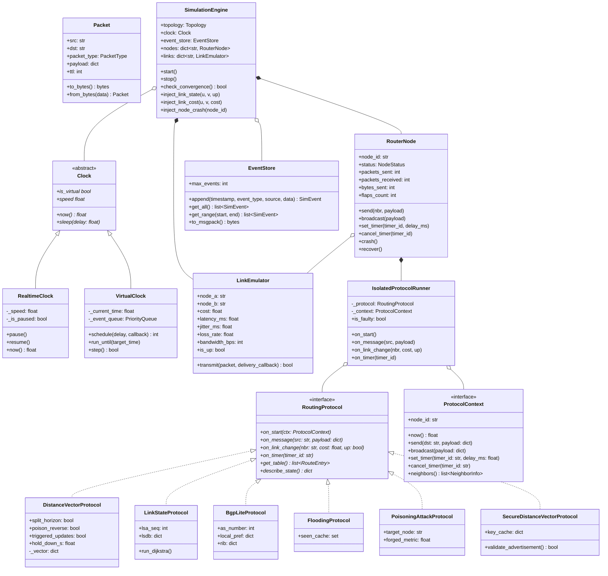

# RouteLab — Class Diagram

This document presents the class hierarchy, interfaces, and component relationships in the RouteLab routing simulator engine.

```mermaid
classDiagram
    %% Core Clock Hierarchy
    class Clock {
        <<abstract>>
        +now() float*
        +sleep(delay: float)*
        +is_virtual bool*
        +speed float*
    }
    class RealtimeClock {
        -_speed: float
        -_is_paused: bool
        +pause()
        +resume()
        +now() float
    }
    class VirtualClock {
        -_current_time: float
        -_event_queue: PriorityQueue
        +schedule(delay, callback) int
        +run_until(target_time)
        +step() bool
    }
    Clock <|-- RealtimeClock
    Clock <|-- VirtualClock

    %% Core Networking & Node Layer
    class Packet {
        +src: str
        +dst: str
        +packet_type: PacketType
        +payload: dict
        +ttl: int
        +to_bytes() bytes
        +from_bytes(data) Packet
    }

    class LinkEmulator {
        +node_a: str
        +node_b: str
        +cost: float
        +latency_ms: float
        +jitter_ms: float
        +loss_rate: float
        +bandwidth_bps: int
        +is_up: bool
        +transmit(packet, delivery_callback) bool
    }

    class RouterNode {
        +node_id: str
        +status: NodeStatus
        +packets_sent: int
        +packets_received: int
        +bytes_sent: int
        +flaps_count: int
        +send(nbr, payload)
        +broadcast(payload)
        +set_timer(timer_id, delay_ms)
        +cancel_timer(timer_id)
        +crash()
        +recover()
    }

    %% Event Store
    class EventStore {
        +max_events: int
        +append(timestamp, event_type, source, data) SimEvent
        +get_all() list~SimEvent~
        +get_range(start, end) list~SimEvent~
        +to_msgpack() bytes
    }

    %% Plugin Architecture
    class RoutingProtocol {
        <<interface>>
        +on_start(ctx: ProtocolContext)*
        +on_message(src: str, payload: dict)*
        +on_link_change(nbr: str, cost: float, up: bool)*
        +on_timer(timer_id: str)*
        +get_table() list~RouteEntry~*
        +describe_state() dict*
    }

    class ProtocolContext {
        <<interface>>
        +node_id: str
        +now() float
        +send(dst: str, payload: dict)
        +broadcast(payload: dict)
        +set_timer(timer_id: str, delay_ms: float)
        +cancel_timer(timer_id: str)
        +neighbors() list~NeighborInfo~
    }

    class IsolatedProtocolRunner {
        -_protocol: RoutingProtocol
        -_context: ProtocolContext
        +is_faulty: bool
        +on_start()
        +on_message(src, payload)
        +on_link_change(nbr, cost, up)
        +on_timer(timer_id)
    }

    %% Concrete Protocol Plugins
    class DistanceVectorProtocol {
        +split_horizon: bool
        +poison_reverse: bool
        +triggered_updates: bool
        +hold_down_s: float
        -_vector: dict
    }
    class LinkStateProtocol {
        +lsa_seq: int
        +lsdb: dict
        +run_dijkstra()
    }
    class BgpLiteProtocol {
        +as_number: int
        +local_pref: dict
        +rib: dict
    }
    class FloodingProtocol {
        +seen_cache: set
    }
    class PoisoningAttackProtocol {
        +target_node: str
        +forged_metric: float
    }
    class SecureDistanceVectorProtocol {
        +key_cache: dict
        +validate_advertisement() bool
    }

    RoutingProtocol <|.. DistanceVectorProtocol
    RoutingProtocol <|.. LinkStateProtocol
    RoutingProtocol <|.. BgpLiteProtocol
    RoutingProtocol <|.. FloodingProtocol
    RoutingProtocol <|.. PoisoningAttackProtocol
    RoutingProtocol <|.. SecureDistanceVectorProtocol

    %% Simulation Engine
    class SimulationEngine {
        +topology: Topology
        +clock: Clock
        +event_store: EventStore
        +nodes: dict~str, RouterNode~
        +links: dict~str, LinkEmulator~
        +start()
        +stop()
        +check_convergence() bool
        +inject_link_state(u, v, up)
        +inject_link_cost(u, v, cost)
        +inject_node_crash(node_id)
    }

    %% Relationships
    SimulationEngine o-- Clock
    SimulationEngine o-- EventStore
    SimulationEngine *-- RouterNode
    SimulationEngine *-- LinkEmulator
    RouterNode o-- LinkEmulator
    RouterNode *-- IsolatedProtocolRunner
    IsolatedProtocolRunner o-- RoutingProtocol
    IsolatedProtocolRunner o-- ProtocolContext
```
